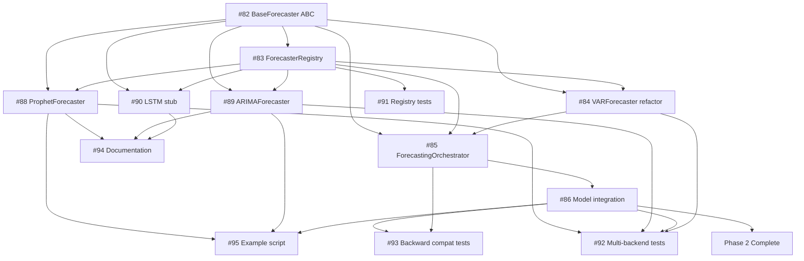

# Multi-Backend Time Series Refactoring - Issues Summary

**Project**: v0.8.0 Multi-Backend Support
**Milestone**: https://github.com/julihocc/epydemics/milestone/4
**Meta Issue**: https://github.com/julihocc/epydemics/issues/97
**Status**: 0/16 complete (16 open)
**Due Date**: January 27, 2025

---

## Quick Links

- 📋 [View All Issues](https://github.com/julihocc/epydemics/issues?q=is%3Aissue+milestone%3A%22v0.8.0+-+Multi-Backend+Support%22)
- 📊 [Milestone Progress](https://github.com/julihocc/epydemics/milestone/4)
- 📝 [Meta Issue #97](https://github.com/julihocc/epydemics/issues/97)
- 📖 [Implementation Plan](/home/codespace/.claude/plans/goofy-questing-moore.md)
- 🔧 [Project Setup Guide](.github/PROJECT_SETUP.md)

---

## Phase 1: Abstraction Layer

**Goal**: Build the foundation for multi-backend support
**Estimated Time**: 17-24 hours (~3-4 days)
**Status**: 0/4 complete

| # | Issue | Est. | Priority | Dependencies |
|---|-------|------|----------|--------------|
| [#82](https://github.com/julihocc/epydemics/issues/82) | Create BaseForecaster ABC interface | 4-6h | 🔴 Critical | None |
| [#83](https://github.com/julihocc/epydemics/issues/83) | Create ForecasterRegistry and decorator pattern | 4-6h | 🔴 Critical | #82 |
| [#84](https://github.com/julihocc/epydemics/issues/84) | Refactor VARForecaster to implement BaseForecaster | 3-4h | 🟠 High | #82, #83 |
| [#85](https://github.com/julihocc/epydemics/issues/85) | Create ForecastingOrchestrator (backend-agnostic) | 6-8h | 🔴 Critical | #82, #83, #84 |

**Key Deliverables**:
- ✅ Abstract base class for all forecasters
- ✅ Registry pattern for backend registration
- ✅ VARForecaster refactored to use new interface
- ✅ Backend-agnostic orchestrator replacing VARForecasting

---

## Phase 2: Model Integration

**Goal**: Integrate the abstraction layer into the Model class
**Estimated Time**: 6-9 hours (~1-2 days)
**Status**: 0/2 complete

| # | Issue | Est. | Priority | Dependencies |
|---|-------|------|----------|--------------|
| [#86](https://github.com/julihocc/epydemics/issues/86) | Add forecaster parameter to Model class | 4-6h | 🔴 Critical | #85 |
| [#87](https://github.com/julihocc/epydemics/issues/87) | Add backend-specific configuration to Settings | 2-3h | 🟡 Medium | None |

**Key Deliverables**:
- ✅ Model accepts `forecaster` parameter
- ✅ Backend-specific kwargs forwarding
- ✅ Configuration system for all backends
- ✅ 100% backward compatibility maintained

---

## Phase 3: New Backends

**Goal**: Implement alternative forecasting backends
**Estimated Time**: 17-22 hours (~3-4 days)
**Status**: 0/3 complete

| # | Issue | Est. | Priority | Dependencies |
|---|-------|------|----------|--------------|
| [#88](https://github.com/julihocc/epydemics/issues/88) | Implement ProphetForecaster backend | 8-10h | 🟠 High | #82, #83 |
| [#89](https://github.com/julihocc/epydemics/issues/89) | Implement ARIMAForecaster backend | 8-10h | 🟠 High | #82, #83 |
| [#90](https://github.com/julihocc/epydemics/issues/90) | Create LSTMForecaster stub for future implementation | 1-2h | 🟢 Low | #82, #83 |

**Key Deliverables**:
- ✅ Prophet backend with native confidence intervals
- ✅ ARIMA backend with auto order selection
- ✅ LSTM placeholder for future work
- ✅ All backends return compatible forecasting_box structure

---

## Phase 4: Testing & Documentation

**Goal**: Comprehensive testing and documentation
**Estimated Time**: 21-28 hours (~3-4 days)
**Status**: 0/6 complete

| # | Issue | Est. | Priority | Dependencies |
|---|-------|------|----------|--------------|
| [#91](https://github.com/julihocc/epydemics/issues/91) | Create comprehensive test suite for ForecasterRegistry | 3-4h | 🟡 Medium | #83 |
| [#92](https://github.com/julihocc/epydemics/issues/92) | Create multi-backend integration tests | 6-8h | 🟡 Medium | #84, #88, #89, #86 |
| [#93](https://github.com/julihocc/epydemics/issues/93) | Add backward compatibility tests for v0.7.0 code | 4-5h | 🟠 High | #86, #85 |
| [#94](https://github.com/julihocc/epydemics/issues/94) | Update CLAUDE.md with multi-backend documentation | 3-4h | 🟡 Medium | All Phase 3 |
| [#95](https://github.com/julihocc/epydemics/issues/95) | Create multi_backend_comparison.py example | 4-5h | 🟢 Low | #88, #89, #86 |
| [#96](https://github.com/julihocc/epydemics/issues/96) | Update pyproject.toml with optional dependencies | 1-2h | 🟡 Medium | None |

**Key Deliverables**:
- ✅ >90% test coverage for new modules
- ✅ Backward compatibility verified
- ✅ Complete documentation in CLAUDE.md
- ✅ Working comparison example
- ✅ Optional dependency groups configured

---

## Issue Labels

All issues are labeled for easy filtering:

- **Phase Labels**: `phase-1`, `phase-2`, `phase-3`, `phase-4`
- **Type Labels**: `enhancement`, `testing`, `documentation`
- **Component Labels**: `abstraction-layer`, `backend`
- **Meta Label**: `epic` (meta issue only)

### Filter Examples

View Phase 1 issues only:
```bash
gh issue list --label "phase-1"
```

View all backend implementation issues:
```bash
gh issue list --label "backend"
```

View critical priority issues (based on dependencies):
```bash
# Critical issues: #82, #83, #85, #86
gh issue view 82 83 85 86
```

---

## Progress Tracking

### Overall Timeline

```
Week 1: Phase 1 (Abstraction Layer)          ━━━━━━━━━━━━━━━━━━━━━━━━━━━━━━━━ 25%
Week 2: Phase 2 (Model Integration)          ━━━━━━━━━━━━━━━━━━━━━━━━━━━━━━━━ 50%
Week 3: Phase 3 (New Backends)               ━━━━━━━━━━━━━━━━━━━━━━━━━━━━━━━━ 75%
Week 4: Phase 4 (Testing & Documentation)    ━━━━━━━━━━━━━━━━━━━━━━━━━━━━━━━━ 100%
```

### Dependency Chain



### Check Progress Anytime

```bash
# Overall milestone progress
gh api repos/julihocc/epydemics/milestones/4 --jq \
  '"\(.closed_issues)/\(.open_issues + .closed_issues) issues complete (\(.closed_issues * 100 / (.open_issues + .closed_issues) | floor)%)"'

# Issues by status
gh issue list --milestone "v0.8.0 - Multi-Backend Support" --json state,title \
  --jq 'group_by(.state) | map({state: .[0].state, count: length})'
```

---

## Implementation Order (Recommended)

### Critical Path (Must be done sequentially)

1. **#82** → Create BaseForecaster ABC (foundation for everything)
2. **#83** → Create ForecasterRegistry (enables registration)
3. **#84** → Refactor VARForecaster (proves the interface works)
4. **#85** → Create ForecastingOrchestrator (domain logic separation)
5. **#86** → Add forecaster parameter to Model (user-facing API)

### Parallel Work Opportunities

After completing the critical path, these can be done in parallel:

**Backend Team**:
- #88 (ProphetForecaster)
- #89 (ARIMAForecaster)
- #90 (LSTM stub)

**Testing Team**:
- #91 (Registry tests)
- #93 (Backward compat tests)

**Documentation Team**:
- #94 (CLAUDE.md updates)
- #95 (Example script)
- #96 (Dependencies)

**Final Integration**:
- #92 (Multi-backend tests) - requires all backends complete

---

## Success Criteria Checklist

### Functionality
- [ ] All 4 phases complete (16 issues closed)
- [ ] VAR backend works identically to v0.7.0
- [ ] Prophet backend fully functional
- [ ] ARIMA backend fully functional
- [ ] LSTM stub registered with helpful error

### Quality
- [ ] Test coverage >90% for new modules
- [ ] All existing tests pass
- [ ] Backward compatibility verified (zero breaking changes)
- [ ] Code review completed

### Documentation
- [ ] CLAUDE.md updated with examples
- [ ] PROJECT_SETUP.md created
- [ ] Example script runs successfully
- [ ] All issues have clear descriptions

### Release Readiness
- [ ] Version bumped to 0.8.0
- [ ] CHANGELOG.md updated
- [ ] Optional dependencies configured
- [ ] Migration guide complete (should note: no migration needed!)

---

## Quick Commands Reference

### View Issues
```bash
# All open issues in this milestone
gh issue list --milestone "v0.8.0 - Multi-Backend Support" --state open

# Phase-specific
gh issue list --label "phase-1" --state open
gh issue list --label "phase-2" --state open
gh issue list --label "phase-3" --state open
gh issue list --label "phase-4" --state open

# By type
gh issue list --label "backend" --state open
gh issue list --label "testing" --state open
gh issue list --label "documentation" --state open

# Meta issue
gh issue view 97
```

### Work on an Issue
```bash
# Assign to yourself
gh issue edit 82 --add-assignee "@me"

# Start working
gh issue comment 82 --body "Starting work on this issue"

# Create branch
git checkout -b feature/issue-82-base-forecaster

# Link PR to issue (when creating PR)
gh pr create --title "feat: Create BaseForecaster ABC (#82)" \
  --body "Closes #82"
```

### Track Progress
```bash
# Milestone summary
gh api repos/julihocc/epydemics/milestones/4 \
  --jq '{title, open: .open_issues, closed: .closed_issues}'

# Issues waiting on you
gh issue list --assignee "@me" --state open \
  --milestone "v0.8.0 - Multi-Backend Support"

# Recently closed
gh issue list --milestone "v0.8.0 - Multi-Backend Support" \
  --state closed --limit 5
```

---

## Getting Help

- **Implementation Questions**: See `/home/codespace/.claude/plans/goofy-questing-moore.md`
- **Project Setup**: See `.github/PROJECT_SETUP.md`
- **General Discussion**: Comment on meta issue [#97](https://github.com/julihocc/epydemics/issues/97)
- **Specific Issue**: Comment on the individual issue

---

*Last Updated: 2025-01-29*
*Milestone: v0.8.0 - Multi-Backend Support*
*Status: 0/16 complete (0%)*
