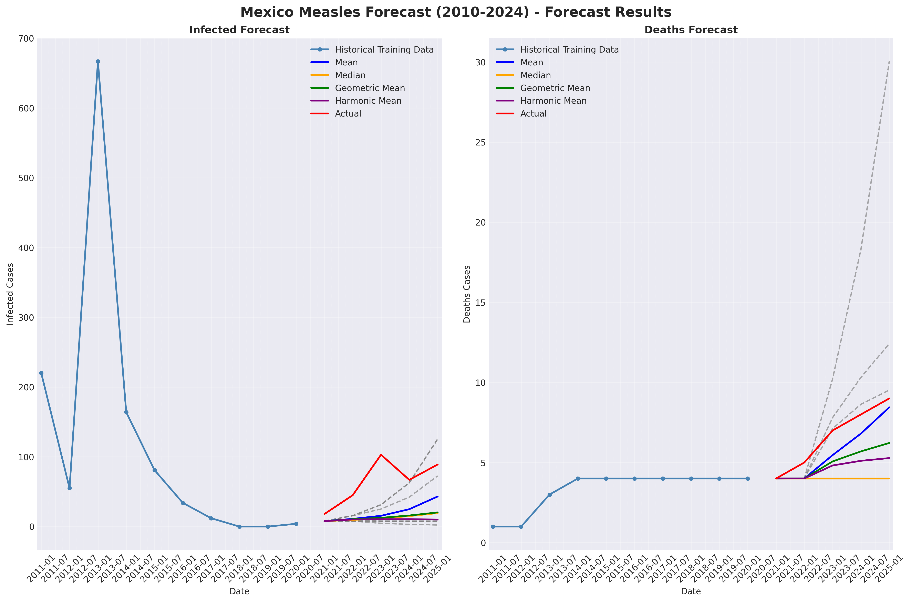

# Mexico Measles Forecast (2010-2024) - Forecast Report

**Generated**: 2025-12-24 17:03:05

---

## Summary Statistics

| Compartment   | Code   |    Mean |   Median |   Std Dev |     Min |      Max |    Range |   CV (%) |
|:--------------|:-------|--------:|---------:|----------:|--------:|---------:|---------:|---------:|
| Infected      | I      | 20.4851 |  12.6801 |  14.1971  | 7.84658 | 43.1243  | 35.2777  |  69.3044 |
| Deaths        | D      |  5.7423 |   4      |   1.90854 | 4       |  8.44424 |  4.44424 |  33.2364 |

## Forecast Evaluation

| Compartment   | Method   |       MAE |     RMSE |   MAPE (%) |   SMAPE (%) |
|:--------------|:---------|----------:|---------:|-----------:|------------:|
| Infected      | Mean     | 43.9149   | 50.5764  |    66.2354 |    50.8458  |
| Infected      | Median   | 51.7199   | 58.7626  |    75.9354 |    62.3126  |
| Infected      | Gmean    | 50.9624   | 57.9558  |    74.8406 |    60.8034  |
| Infected      | Hmean    | 54.5453   | 62.0783  |    79.277  |    67.223   |
| Deaths        | Mean     |  0.857699 |  1.0103  |    12.613  |     6.93965 |
| Deaths        | Median   |  2.6      |  3.19374 |    33.6825 |    22.0357  |
| Deaths        | Gmean    |  1.60334  |  1.88569 |    21.4561 |    12.4411  |
| Deaths        | Hmean    |  1.95984  |  2.3666  |    25.7404 |    15.5458  |

## Forecast Visualization

